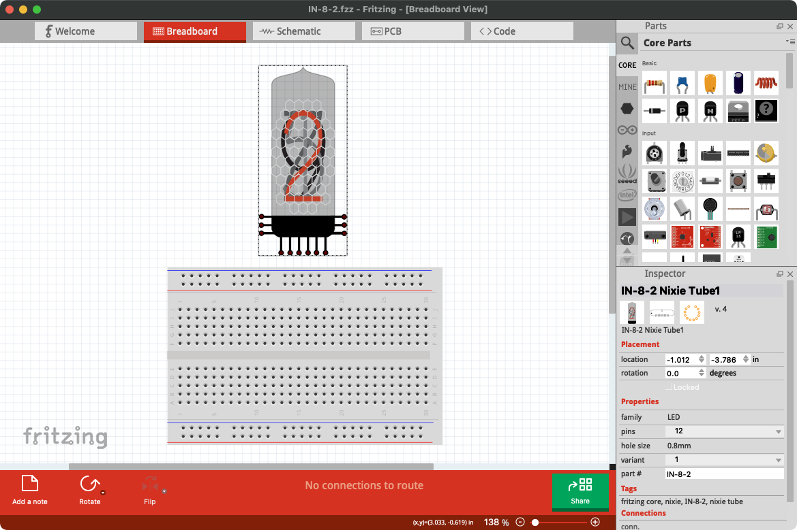
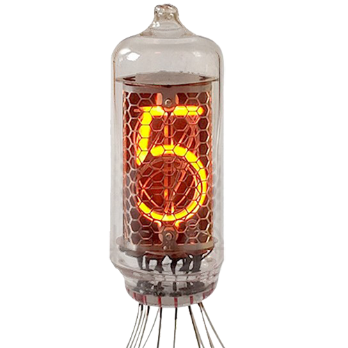

# IN-8-2-Nixie-Tube-Fritzing

A Fritzing part for ИН-8-2 (IN-8-2) Nixie Tubes.

[Download `IN-8-2 Nixie.fzpz` here](https://github.com/otherguy/IN-8-2-Nixie-Tube-Fritzing/raw/master/IN-8-2%20Nixie.fzpz)

## 🤔 What?

These [Nixie tubes](https://en.wikipedia.org/wiki/Nixie_tube) were made by МЭЛЗ (Melz Tube
Factory in Moscow, Russia) in the 1980s and have a normal number “5” instead of an upside
down “2”. They also have long, versatile, directly solderable wires and don't require sockets.

| Data                     | Value                                          |
| ------------------------ | ---------------------------------------------- |
| Type                     | **IN-8-2** (ИН-8-2)                            |
| Manufacturer             | **МЭЛЗ** (Melz Tube Factory in Moscow, Russia) |
| Displayed symbols        | 0–9, PR                                        |
| Digit height             | 18 mm (0.71")                                  |
| Tube diameter nominal    | 18 mm (0.71")                                  |
| Tube diameter maximal    | 19 mm (0.75")                                  |
| Tube height              | 55 mm (2.17")                                  |
| Firing voltage           | 170 V                                          |
| Sustaining voltage       | 135 V                                          |
| Anode voltage maximal    | 200 V                                          |
| Anode voltage minimal    | 100 V                                          |
| Cathode current (digits) | 2.5–4.5 mA                                     |
| Cathode current (PR)     | 0.3–0.7 mA                                     |
| Weight                   | 12g                                            |

## 🙏 Acknowledgements

Greatly modified and improved by [@vanepp](https://forum.fritzing.org/u/vanepp) on the Fritzing Forums
